

# Telegram Booking Bot & Mini App

**Turn Telegram into your booking system — no website, no messy DMs, no missed appointments.**

Ready-to-launch solution for freelancers, trainers, tutors, barbers, therapists, and any appointment-based business.

 

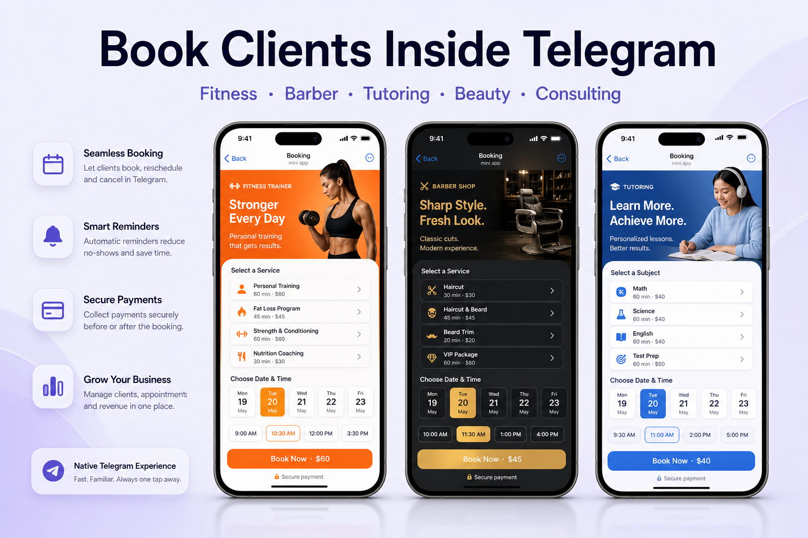

 

---

## Built for Real Businesses

| Niche | Use case |
|-------|----------|
| **Personal trainers** | Session booking, packages, reminders |
| **Barbers & salons** | Service-based slots, premium branded UI |
| **Tutors & teachers** | Lesson scheduling, parent-friendly flow |
| **Therapists & consultants** | Calm booking experience, online sessions |
| **Beauty & wellness** | Treatments, memberships, no-show reduction |
| **Freelancers** | Professional intake without a separate website |

> **Your client books in 2–3 taps — while competitors still reply in DMs.**

---

## White-Label by Niche

Each client gets a **unique look and feel** — not a generic template.

### Personal Trainer — energetic, bold

<table>
  <tr>
    <td width="280">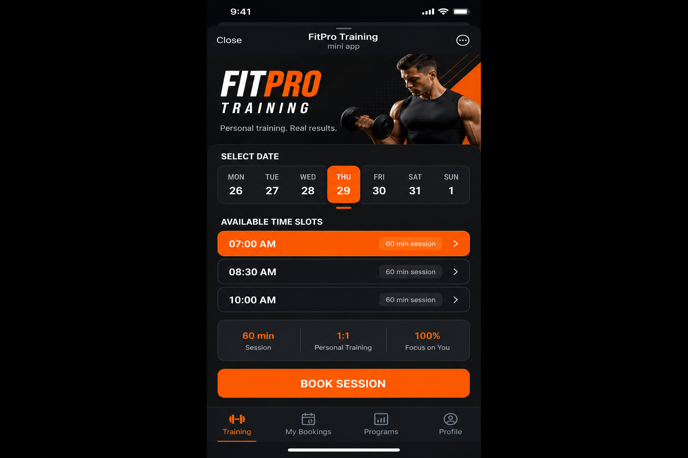</td>
    <td>
      <b>FitPro Training</b> 
      Dark UI + orange accents · 60-min sessions · package support  
      Perfect for coaches, gyms, and fitness studios.
    </td>
  </tr>
</table>

### Barber — premium, masculine

<table>
  <tr>
    <td width="280">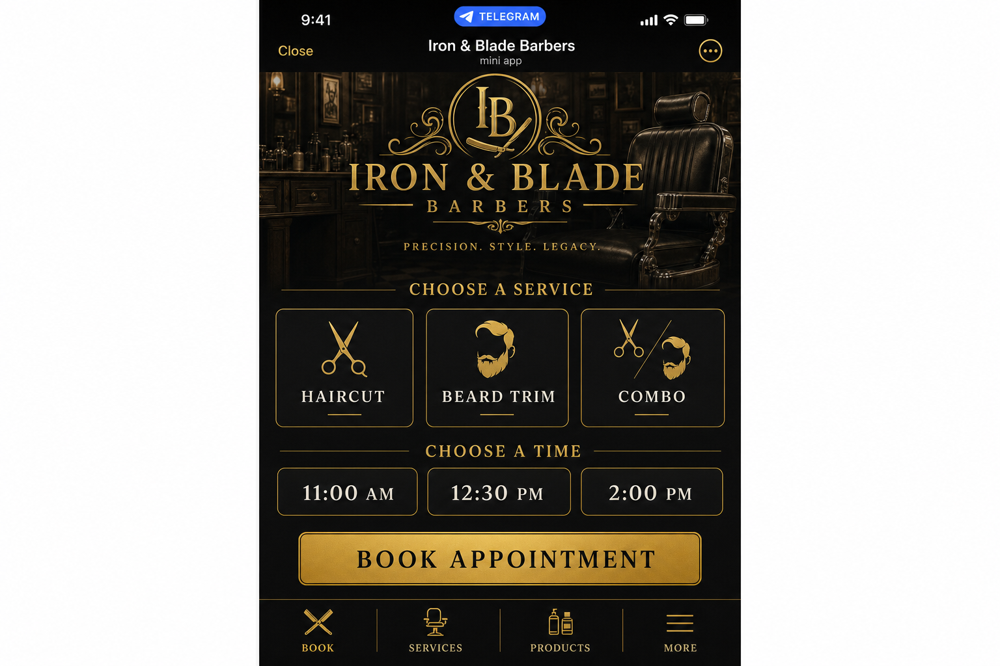</td>
    <td>
      <b>Iron & Blade Barbers</b> 
      Black & gold aesthetic · service picker (Haircut, Beard, Combo)  
      Built for barbershops and grooming brands.
    </td>
  </tr>
</table>

### Tutoring — clean, academic

<table>
  <tr>
    <td width="280">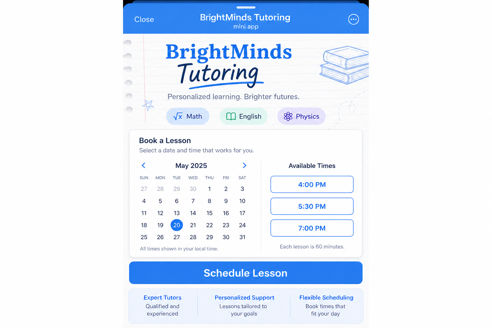</td>
    <td>
      <b>BrightMinds Tutoring</b> 
      Sky blue education UI · subject tags · flexible lesson slots  
      Ideal for tutors, language teachers, and online schools.
    </td>
  </tr>
</table>

### Beauty & Wellness — elegant, soft

<table>
  <tr>
    <td width="280">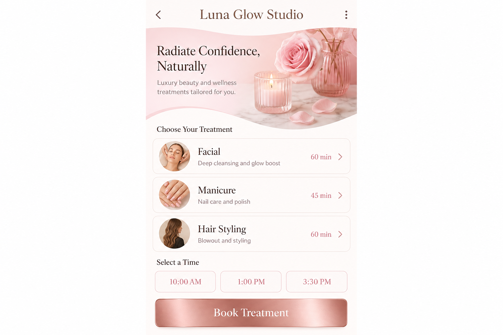</td>
    <td>
      <b>Luna Glow Studio</b> 
      Blush & cream palette · treatment list with durations  
      For salons, spas, and beauty professionals.
    </td>
  </tr>
</table>

### Counseling — calm, trustworthy

<table>
  <tr>
    <td width="280">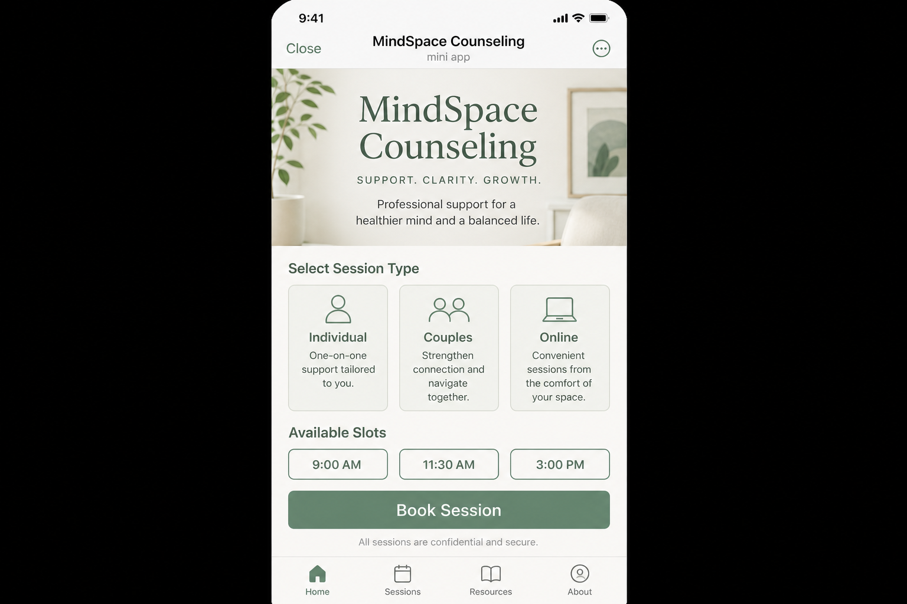</td>
    <td>
      <b>MindSpace Counseling</b> 
      Sage green wellness UI · individual, couples, online sessions  
      For psychologists, coaches, and consultants.
    </td>
  </tr>
</table>

---

## How It Works in Telegram

Clients never leave Telegram. The bot handles entry points and notifications; the Mini App handles the booking UI.

<table>
  <tr>
    <td align="center" width="50%">
      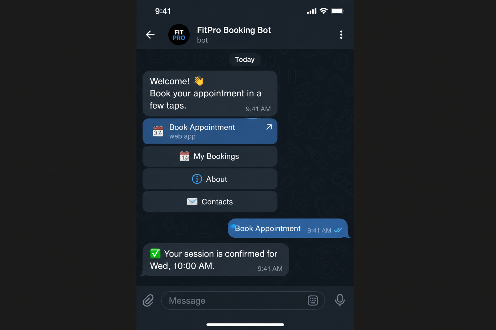 
      <b>Bot menu & booking</b> 
      /start → Book Appointment → Mini App opens → confirmation in chat
    </td>
    <td align="center" width="50%">
      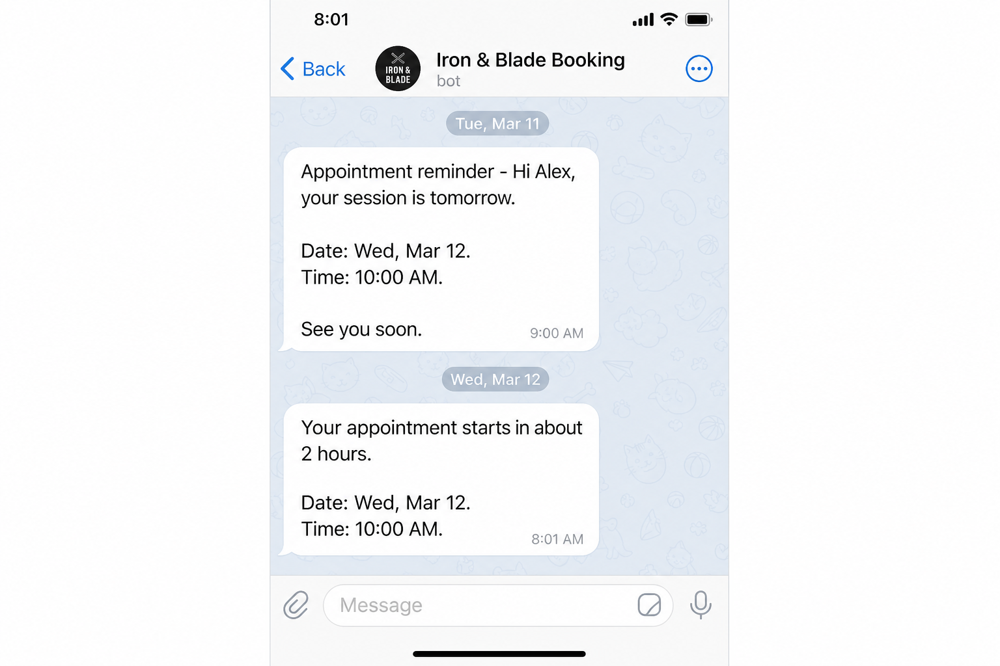 
      <b>Automated reminders</b> 
      24h and 2h before appointment — sent automatically by the bot
    </td>
  </tr>
</table>

**Typical flow:**
1. Client opens your bot and taps **Book Appointment**
2. Mini App opens with your branded calendar
3. Client picks a slot and confirms
4. Bot sends confirmation in chat
5. Reminders go out automatically before the visit

---

## Client & Admin Screens

<table>
  <tr>
    <td align="center" width="50%">
      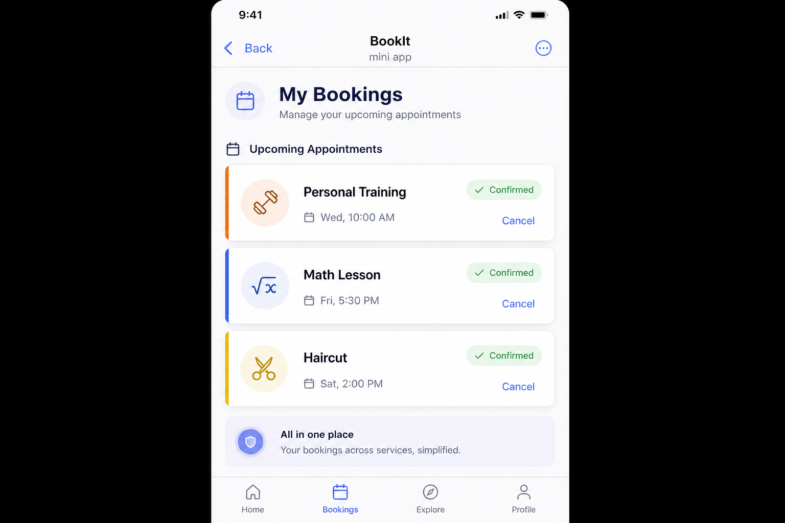 
      <b>My Bookings</b> 
      Upcoming visits across all service types
    </td>
    <td align="center" width="50%">
      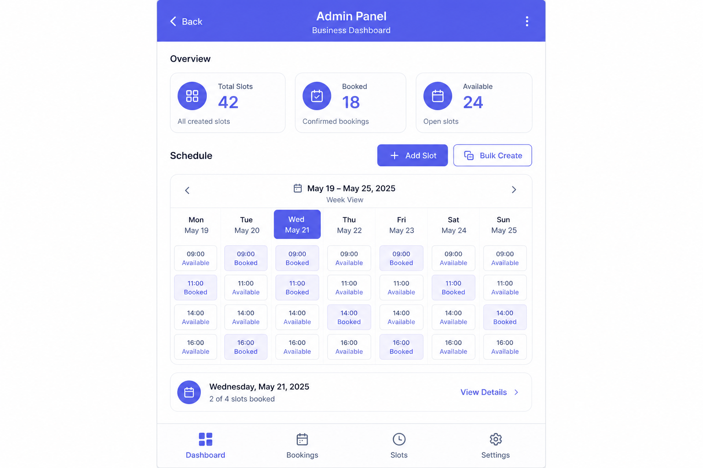 
      <b>Admin Panel</b> 
      Slots, stats, bulk creation, manual booking
    </td>
  </tr>
</table>

---

## Problem → Solution

| Before | After |
|--------|-------|
| Endless DM scheduling | Structured booking in Telegram |
| Clients forget appointments | Auto reminders at 24h and 2h |
| Schedule in notes or Excel | Admin panel with live stats |
| No package sales | Single sessions + subscription packages |
| Generic chat experience | Branded Mini App per niche |

---

## What's Included

- **Telegram Bot** — menu, commands, push notifications
- **Telegram Mini App** — booking UI with niche-specific branding
- **Admin panel** — slot management, manual booking, stats
- **Auto reminders** — 24h and 2h before appointment
- **Cancellation rules** — configurable cutoff (e.g. 24h)
- **Packages** — single bookings + session bundles
- **White-label** — name, copy, prices, currency, timezone
- **Google Calendar** — optional sync

---

## System Flow

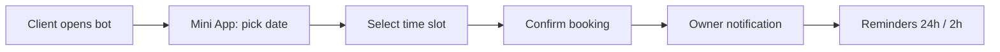

## Architecture

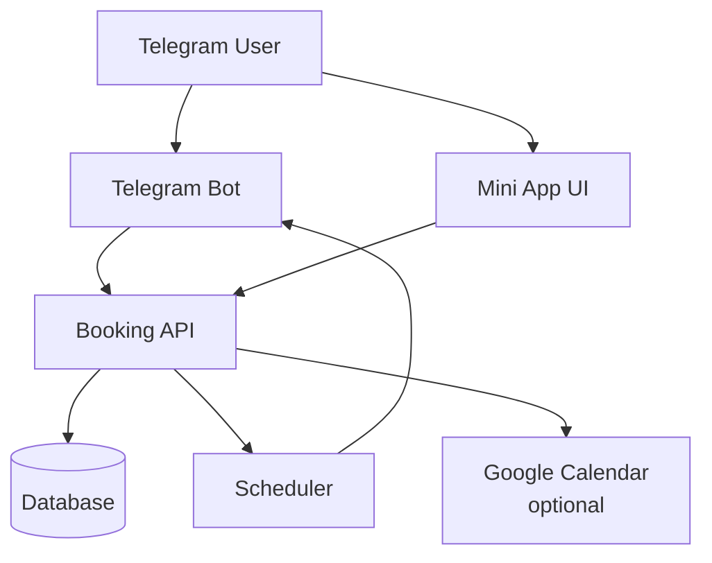

---

## Packages

You get a **working bot for your business** — not a raw code dump.

| Package | What's included | Timeline* |
|---------|-----------------|-----------|
| **Launch** | Deploy, webhook, branding, pricing setup | 2–4 days |
| **Full Setup** | Launch + niche customization + payments + calendar | 4–10 days |
| **Custom** | Multi-service, integrations, advanced flows | On request |

\* Depends on scope and integrations.

> Pricing is custom based on niche, language, integrations, and support.

---

## Tech Stack

| Layer | Technology |
|-------|------------|
| Backend | FastAPI, Aiogram |
| Database | PostgreSQL / SQLite |
| Scheduler | APScheduler |
| Frontend | Telegram WebApp (vanilla JS) |
| Integrations | Google Calendar (optional) |
| Hosting | Render and similar platforms |

---

## FAQ

<b>Do I need a separate website?</b>

 
No. Clients book directly inside Telegram via the Mini App.

<b>Can it match my brand and niche?</b>

 
Yes. Each deployment gets custom colors, copy, services, and booking rules — as shown in the niche examples above.

<b>Can payments be connected?</b>

 
Yes, within the Full Setup or Custom package scope.

<b>Does it work without Google Calendar?</b>

 
Yes. Calendar sync is fully optional.

<b>Is this repo the full source code?</b>

 
No. This is a public product showcase. The live bot is delivered and deployed as a managed service per agreement.

---

## Contact

Want a demo or a quote for your business? Send:

- your niche (trainer, barber, tutor, etc.)
- interface language
- currency and pricing model
- target launch date

| | |
|---|---|
| **Telegram** | `@your_username` |
| **Email** | `you@example.com` |

 

**Book clients inside Telegram — while your competitors are still scheduling in DMs.**

 

---

Public product showcase · Commercial use by agreement · <a href="LICENSE_COMMERCIAL.md">Terms</a>

