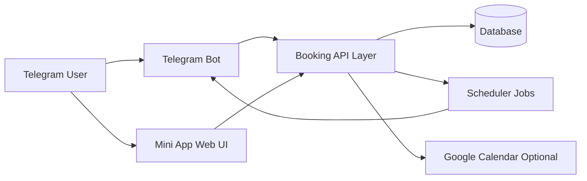

# Telegram Booking Bot (Public Showcase)

Sell appointments directly inside Telegram.

This repository is a public showcase for a ready-to-launch Telegram Mini App for service businesses: coaches, psychologists, beauty studios, consultants, tutors, and any appointment-based niche.

## What Clients Get

- Booking flow inside Telegram (no separate website needed)
- Clean calendar UI with available time slots
- Admin panel for schedule management
- Booking cancellation rules
- Automatic reminders (24h and 2h)
- Optional Google Calendar sync
- Package/subscription support
- White-label branding (name, texts, prices, timezone)

## Why This Product Sells

- Faster conversion from chat to booking
- Lower no-show rate with reminders
- Easy operational control for business owners
- Flexible customization for different niches
- Quick launch timeline

## Demo Flow

1. User opens bot and mini app
2. Chooses date and available slot
3. Confirms booking (with payment step if required)
4. Admin sees updates in panel
5. Reminders are sent automatically

## Screenshots & Video

Add your media files to:

- `docs/screenshots/client-booking.png`
- `docs/screenshots/my-bookings.png`
- `docs/screenshots/admin-panel.png`
- `docs/video/demo.mp4`

Then reference them in this section:

Demo video:
- [Watch product demo](docs/video/demo.mp4)

## Packages (Example)

### 1) Setup Package
- Deployment on hosting
- Bot/webhook configuration
- Branding and pricing setup

### 2) Full White-Label
- Everything above
- Niche-specific flow customization
- Integration support (calendar/payment where applicable)
- Post-launch support period

### 3) Buyout / Exclusive
- Full transfer or exclusive rights
- Separate scope and pricing agreement

> Pricing is custom based on scope, niche, and integrations.

## Best Fit Industries

- Fitness and coaching
- Therapy and psychology
- Beauty and wellness
- Consulting and advisory
- Education and tutoring
- Medical and private practice scheduling

## Tech Highlights

- Backend: FastAPI + Aiogram
- DB: PostgreSQL / SQLite
- Scheduler: APScheduler
- Frontend: Telegram WebApp (Vanilla JS)
- Integrations: Google Calendar (optional)

## System Architecture

Architecture notes:
- Bot handles user entry points and notifications.
- Mini App handles booking UX and admin UX.
- API layer validates roles, booking rules, and business logic.
- Scheduler automates reminders and cleanup jobs.
- Google Calendar sync is optional and can be disabled.

## Core Flows

### Booking Flow
User selects slot -> system validates availability -> booking is created -> optional payment step -> confirmation sent.

### Cancellation Flow
User requests cancellation -> cutoff policy is checked -> booking status is updated -> optional calendar event removal.

### Reminder Flow
Scheduled jobs scan upcoming bookings -> reminders are sent at configured time offsets -> send flags prevent duplicates.

### Admin Flow
Admin opens panel -> creates/updates slots -> can manually assign bookings -> sees operational stats.

## Customization Layer

What changes per client:
- branding (name, texts, contact block)
- pricing and package model
- timezone and cancellation policy
- optional integrations

What stays as product core:
- booking engine logic
- admin scheduling workflow
- reminder automation
- deployment architecture

## Delivery & Licensing

- Delivered as a private client project
- Commercial terms: see `LICENSE_COMMERCIAL.md`
- Buyout/exclusive option available by separate agreement

## FAQ

### Can it be adapted for my niche?
Yes. Texts, pricing, booking rules, and branding are configurable.

### Can I connect payment?
Yes. Payment integration can be added in setup/custom package scope.

### Can I run it without Google Calendar?
Yes. Calendar sync is optional.

### How fast can we launch?
Usually from 1 to 10 days depending on package and customization depth.

### Is full source code included in this public repository?
No. This public repository is a product showcase.
Private delivery format depends on the selected package and agreement.

## Contact

To request a demo or estimate, send:
- your niche
- preferred language
- currency
- target launch date

Contact:
- Telegram: `@your_username`
- Email: `you@example.com`

---

If you are viewing this as a client, request a private demo build tailored to your business.

